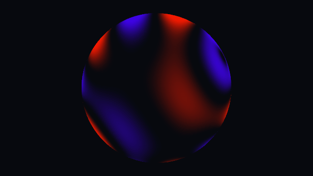
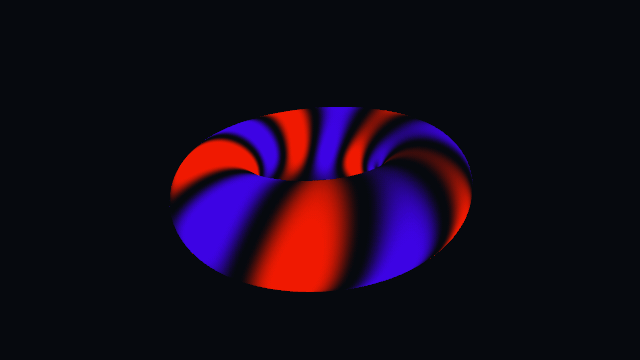
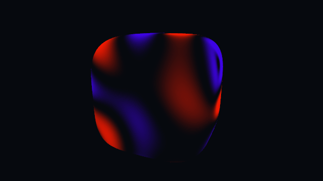
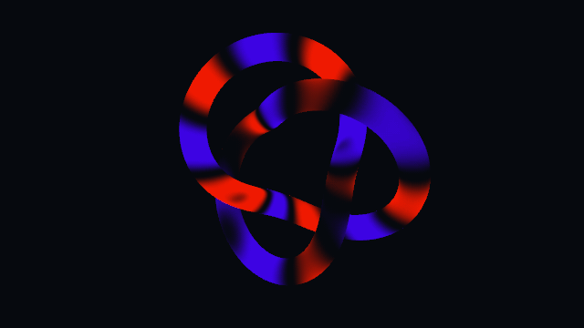
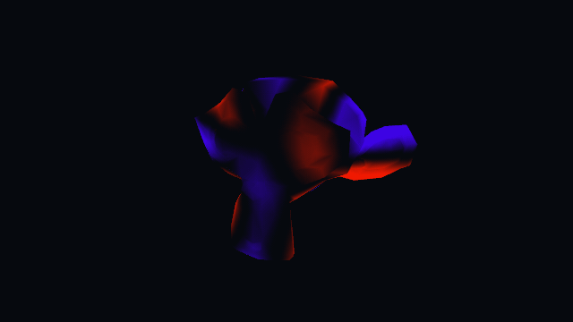

# quantum-wave-sphere

A cross-platform C++23/OpenGL 4.6 showcase that applies one animated wave field to five
embedded surfaces: an icosphere, torus, boxy superellipsoid, trefoil-knot tube, and Suzanne.

The Dear ImGui `Geometry` control switches the active preloaded surface without resetting the
shared animation, wave parameters, pause state, or wireframe mode.

> **Learning project and AI assistance**
>
> This is an educational repository documenting my approach to learning C++ and graphics
> programming. I use AI to brainstorm ideas, plan the project, and write code incrementally.
> At each step, I study and review the implementation, working through the concepts and design
> decisions behind it. The code is AI-assisted, and I have personally worked through all of it
> and understand how it works. Building that understanding is the purpose of the project and
> the central part of this learning method.

## Geometry gallery

Each preview uses the application defaults and samples the complete shared `8π`-second animation
period. The duplicate terminal frame is omitted, so every GIF repeats with one ordinary frame step
across its loop boundary.

| Icosphere | Torus |
|:--:|:--:|
|  |  |
| Superellipsoid | Trefoil knot |
|  |  |
| Suzanne | |
|  | |

Regenerate every preview from the renderer with Python 3.9 or newer, FFmpeg, ffprobe, and the
platform build prerequisites listed below:

```text
# Windows
python tools/generate_readme_animations.py

# Linux
python3 tools/generate_readme_animations.py
```

The standard-library-only generator builds a platform-specific Release executable, captures
deterministic RGB24 frames from a hidden OpenGL window, and uses FFmpeg to create and validate the
looping GIFs. Linux capture requires an active X11 or XWayland display. Run the script with
`--help` to select geometries, dimensions, frame rate, output location, or raw-frame retention.

Suzanne uses Blender's original low-poly control cage, compiled directly into the executable as
typed vertices and triangle indices. Blender is not a build or runtime dependency. To regenerate
the embedded control cage with Blender 5.2, run:

```powershell
& "C:\Program Files\Blender Foundation\Blender 5.2\blender.exe" `
    --background --factory-startup `
    --python tools/generate_suzanne_control_mesh.py
```

The generator creates Blender's factory Suzanne, converts it to the application's Y-up coordinate
system, fits it to a unit bounding sphere, and stores its 507 vertices and 968 triangles without
runtime parsing or decompression.

## Platform scope

- Windows x64: supported with MSVC.
- Ubuntu 24.04 x64: supported with GCC or Clang. GLFW uses its X11 backend; Wayland sessions
  run through XWayland. Native Wayland is currently out of scope.
- macOS: **not supported**. Apple does not provide OpenGL 4.6 or GLSL 460. The macOS GitHub
  Actions job verifies this explicit configure-time rejection instead of pretending to build a
  supported renderer.

## Dependencies and build tools

The build uses CMake 3.25 or newer, Ninja, a C++23 compiler, and vcpkg in manifest mode. The
manifest is pinned to vcpkg commit `9e593bb18ea69cc5095e012465dcd675a822ed0d` (release tag
`2026.07.29`). vcpkg owns GLFW, Dear ImGui, GLM, and Catch2.

A reproducibly generated GLAD2 v2.0.8 OpenGL 4.6 Core loader is checked in under
`third_party/glad`; its exact source revision and generator arguments are recorded in
`third_party/glad/PROVENANCE.md`. A clean application build does not need Python or Jinja2; Python
is only needed to regenerate the README animations or the checked-in Suzanne control mesh.

To keep vcpkg local to the checkout:

```powershell
git clone --depth 1 --branch 2026.07.29 https://github.com/microsoft/vcpkg.git .tools/vcpkg
git -C .tools/vcpkg rev-parse HEAD
.tools\vcpkg\bootstrap-vcpkg.bat -disableMetrics
$env:VCPKG_ROOT = (Resolve-Path .tools/vcpkg).Path
```

The printed commit must be `9e593bb18ea69cc5095e012465dcd675a822ed0d`. On Linux, use
`.tools/vcpkg/bootstrap-vcpkg.sh -disableMetrics` and
`export VCPKG_ROOT="$PWD/.tools/vcpkg"` instead.

On Debian/Ubuntu, GLFW's X11 build prerequisites can be installed with:

```bash
sudo apt-get install build-essential clang cmake ninja-build pkg-config \
  libglu1-mesa-dev libxcursor-dev libxinerama-dev xorg-dev
```

The Linux executable explicitly selects `GLFW_PLATFORM_X11`. In a Wayland desktop session,
XWayland and a valid `DISPLAY` are therefore required; `WAYLAND_DISPLAY` alone is not enough.

No globally installed project libraries are required beyond the system platform prerequisites
listed above. The ignored `.tools/` and `out/` directories are safe locations for
checkout-local tools and build artifacts.

## Configure and build

Run Windows commands from an x64 Visual Studio developer shell:

```powershell
cmake --preset windows-msvc-debug
cmake --build --preset windows-msvc-debug
```

If CMake and Ninja are not installed, the pinned local vcpkg can fetch portable copies without
changing the system installation:

```powershell
$cmake = (& "$env:VCPKG_ROOT\vcpkg.exe" fetch cmake | Select-Object -Last 1)
$ninja = (& "$env:VCPKG_ROOT\vcpkg.exe" fetch ninja | Select-Object -Last 1)
$env:Path = "$(Split-Path $ninja);$env:Path"
& $cmake --preset windows-msvc-debug
& $cmake --build --preset windows-msvc-debug
```

Linux GCC commands are:

```bash
cmake --preset linux-gcc-debug
cmake --build --preset linux-gcc-debug
```

Release presets are `windows-msvc-release` and `linux-gcc-release`. Every configure preset
writes `compile_commands.json` to `out/build/<preset>/compile_commands.json`; this also works
with MSVC because all presets use Ninja. vcpkg install trees are separated by host platform
under `out/vcpkg_installed/`, so alternating between Windows and Linux does not evict the other
platform's packages.

## Run and smoke test

Windows:

```powershell
.\out\build\windows-msvc-debug\quantum-wave-sphere.exe
```

Linux:

```bash
./out/build/linux-gcc-debug/quantum-wave-sphere
```

To run the automated real-context smoke check on Windows:

```powershell
.\out\build\windows-msvc-debug\quantum-wave-sphere.exe --smoke-test
```

The smoke process exits automatically with a nonzero status when the check fails.

## Tests

```powershell
ctest --preset windows-msvc-debug
```

```bash
ctest --preset linux-gcc-debug
```

CTest discovers the Catch2 cases individually and prints failures through the preset.

## Sanitizers

MSVC AddressSanitizer:

```powershell
cmake --preset windows-msvc-asan
cmake --build --preset windows-msvc-asan
ctest --preset windows-msvc-asan
```

This preset requires Visual Studio's optional MSVC AddressSanitizer runtime component and fails
at configure time with a direct diagnostic when that component is unavailable. First-party
targets disable MSVC's separate STL string/vector annotations to remain ABI-compatible with the
non-instrumented vcpkg libraries; AddressSanitizer itself remains enabled.

Linux Clang AddressSanitizer plus UndefinedBehaviorSanitizer:

```bash
cmake --preset linux-clang-asan
cmake --build --preset linux-clang-asan
ctest --preset linux-clang-asan
```

Sanitizer flags apply only to first-party targets, not vendored or vcpkg code.

## Formatting and static analysis

Check formatting:

```powershell
$sourceFiles = Get-ChildItem src,tests -Recurse -File -Include *.cpp,*.hpp
clang-format --dry-run --Werror $sourceFiles.FullName
```

The equivalent Linux command is:

```bash
find src tests -type f \( -name '*.cpp' -o -name '*.hpp' \) -print0 \
  | xargs -0 clang-format --dry-run --Werror
```

Apply formatting by replacing `--dry-run --Werror` with `-i`. Handwritten C++ is governed by
`.clang-format`; generated GLAD2 files are excluded.

Run clang-tidy during a build:

```powershell
cmake --preset windows-msvc-debug -DQWS_ENABLE_CLANG_TIDY=ON
cmake --build --preset windows-msvc-debug
```

On Linux, replace the preset with `linux-gcc-debug`. Configuration fails clearly when
`clang-tidy` is requested but unavailable. The checks live in `.clang-tidy`, and only
first-party targets opt into them.
